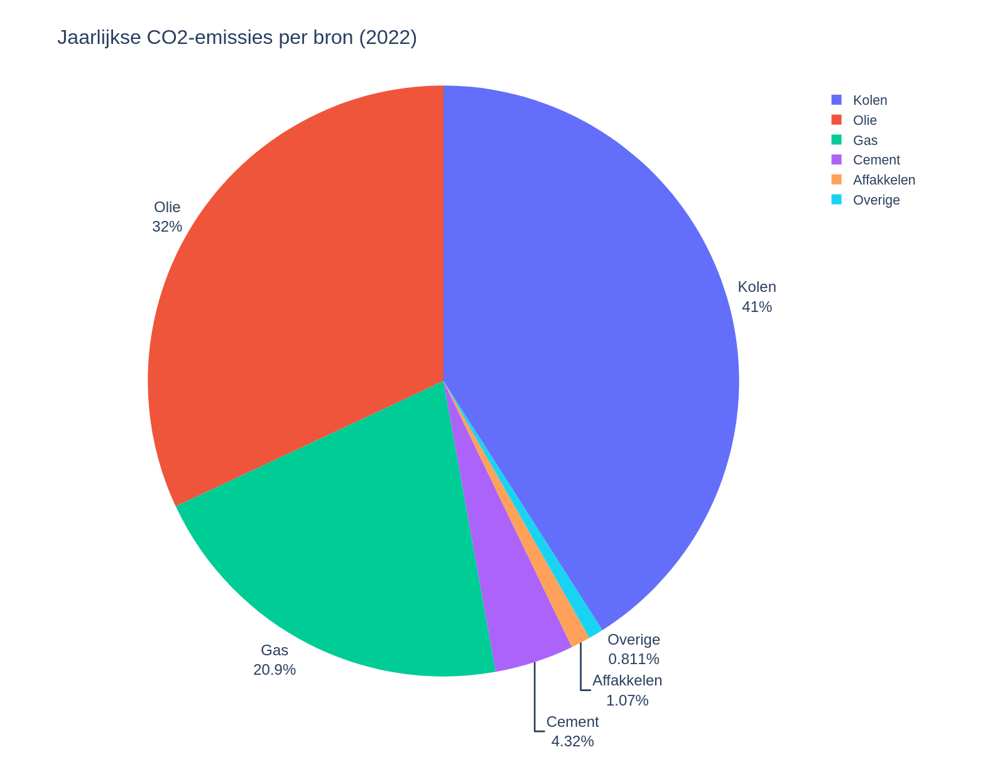

<!-- #region -->
Welvaart, Uitstoot & Verduurzaming

## Inleiding

Terwijl economische groei lange tijd werd gezien als een manier om de wereldwijde levensstandaarden te verbeteren, roept deze ontwikkeling de laatste decennia vragen op over de duurzaamheid hiervan.
Alhoewel  er nieuwe wet- en regelgeving is ingevoerd die gericht is op het verminderen van wereldwijde CO2-emissies, blijft de klimaatverandering een onopgelost probleem.
De wetenschappelijke consensus is vooralsnog dat de mens een sleutelrol speelt in de opwarming van de aarde ten gevolge van het broeikaseffect (Lynas et al., 2021). Aangezien CO2 het broeikasgas is dat, op waterdamp en wolken na, de grootste bijdrager is aan het broeikaseffect (Schmidt et al., 2010), hebben wij besloten te kijken naar de relatie tussen de HDI, een maatstaf voor de welvaart van een land, en de CO2 emissie om mogelijke correlaties te onderzoeken.

Om ons onderwerp in te leiden en de stand van zaken van CO2-emissies te visualiseren, zien we in onderstaand figuur de verdeling van CO2-emissies per bron weergegeven. Opvallend is dat kolen, olie en gas, bekend om hun aanzienlijke milieueffecten, nog steeds verantwoordelijk zijn voor de grootste hoeveelheid CO2-uitstoot.

[Klik hier om naar de data story te gaan](../notebooks/story.ipynb)

**Auteurs**

- Anou Prins
- Tom Kuin
- Efehan Kuznek
- Goof van Riet
<!-- #endregion -->
